# Subtractive Mixture Models via Squaring:

# Representation and Learning

Lorenzo Loconte

University of Edinburgh,UK

AleksanteriM.Sladek

Aalto University,Fl

Stefan Mengel

University of Artois,CNRS,CRIL,FR

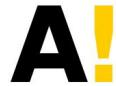  
Aalto University

  
UNIVERSITE D'ARTOIS

# Mixture models

$$
p (\mathbf {X}) = \sum_ {i = 1} ^ {K} w _ {i} p _ {i} (\mathbf {X}) \quad \text {s u b j e c t t o} \quad w _ {i} \geq 0 \quad \sum_ {i = 1} ^ {K} w _ {i} = 1
$$

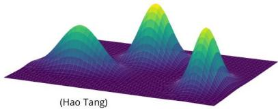

X components can only beadded together!

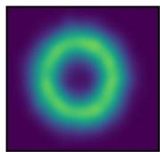  
Ground Truth

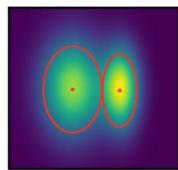  
w1N1+w2N2

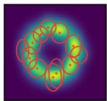  
wiNi+...wKNK

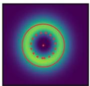  
N1-w2N2

Fewer components with subtractions

# Questions?

...Contributions!

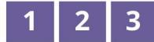

# 1 How to learn subtractive mixture models?

$$
p (\mathbf {X}) = \sum_ {i = 1} ^ {K} w _ {i} p _ {i} (\mathbf {X}) \quad w _ {i} \in \mathbb {R}
$$

How to ensure $p ( \mathbf { X } )$ is non-negative?

$\Longrightarrow$ Impose ad-hoc constraints over the parameters

$\times$ challenging to derive in closed-form [1][2][3]

# 2How much more expressive are they?

with respect to traditional additive-only mixtures

# 3What is their relationship with other models?

understanding why they are expressive...

... and why they support tractable inference

# TL "We learn exponentially more expressive mixture models DR with subtractions, by squaring deep tensorized mixtures"

Learning deep subtractive mixtures by squaring layers of a deep circuit

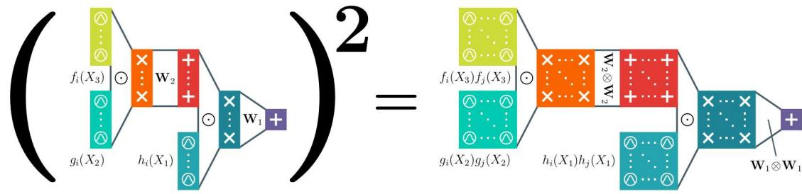

Arno Solin

Aalto University,Fl

Nicolas Gillis

Université de Mons, BE

Antonio Vergari

University of Edinburgh, UK

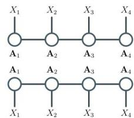  
Born machines [6]

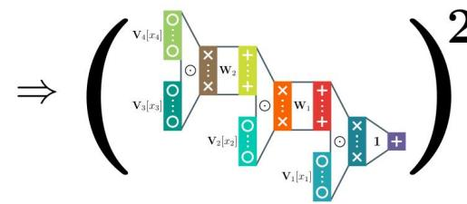

$$
\begin{array}{l} p (\mathbf {x}) \propto \kappa (\mathbf {x}) ^ {\top} \mathbf {A} \kappa (\mathbf {x}) \\ \text {P S D m o d e l s [ 7 ]} \end{array} \Rightarrow \sum \left(\bigcirc\right) ^ {2}
$$

# 3 Understanding the expressiveness of other models in a unifying framework

# 1 Squaring mixtures...

$$
p (\mathbf {X}) \propto \left(\sum_ {i = 1} ^ {K} w _ {i} \boldsymbol {p} _ {i} (\mathbf {X})\right) ^ {2} = \sum_ {i = 1} ^ {K} \sum_ {j = 1} ^ {K} w _ {i} w _ {j} \boldsymbol {p} _ {i} (\mathbf {X}) \boldsymbol {p} _ {j} (\mathbf {X})
$$

Renormalization:

$$
Z = \sum_ {i = 1} ^ {K} \sum_ {j = 1} ^ {K} w _ {i} w _ {j} \int p _ {i} (\mathrm {X}) p _ {j} (\mathrm {X}) \mathrm {d X}
$$

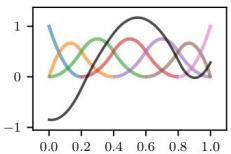

Tractable marginalization is supported by exponential families [2] and splines components

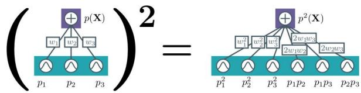  
... by squaring circuits

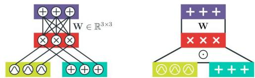  
Build deep mixtures with layers as "Lego blocks"

# Theorem.exponential separation [4][5]

2 Thereisesftisasas $\mathcal { F }$ sverermiles X that catbe weights，but the smallest structured decomposable additive-only mixture of any depth computing any $F \in { \mathcal { F } }$ has size 22(|Xl).

Deep additive-only mixtures

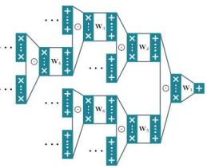

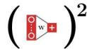  
Squared subtractive mixture model

#

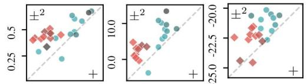  
Power

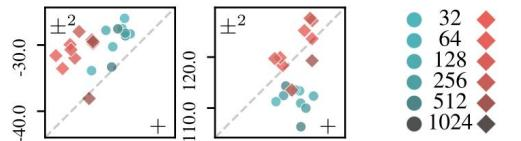  
MiniBooNE BSDS300

#

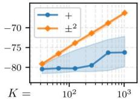  
LL Training data

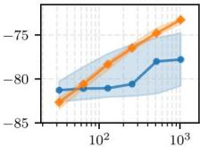  
LL Testdata

# References

[1] B. Zhang and C. Zhang.“Finite mixture models with negative components*. In: MLDM.Springer.20O5, pp. 31-41.

[2]G. RabusseauandF.Denis.Learingnegativemiuremodels bytensordecompositions.Inaivpreprintiv4.42242014)

]

4]J.MartensandVMedabalii.“Ontheexpresiveefiencyofsmprodutnetworksn:ivrepriniv:14.77(014)

[5]A.de Colnet andS.Mengel."A CompilationofSuccinctnessResults for ArithmeticCircuits,In: KR.2021,pp.205-215.

6]se

[7]ARuiadCepeseaiotieobbiels.N.tes942