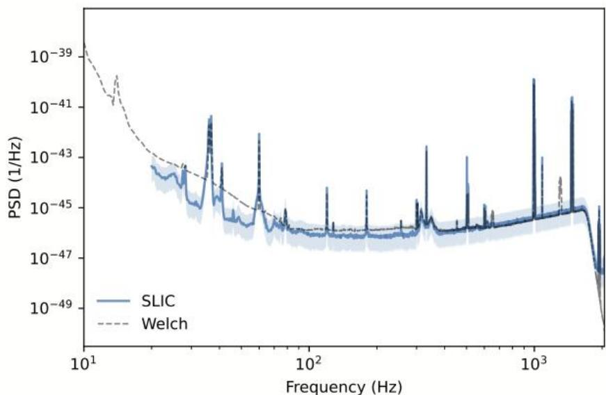
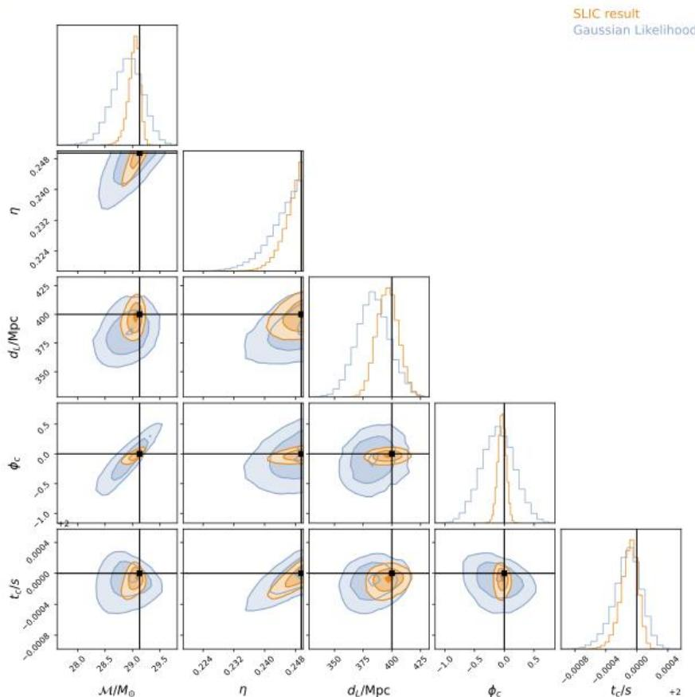

# Towards Unbiased Gravitational-Wave Parameter Estimation using SLIC

Hezav

# Summary/Objectives

Gravitational wave (GW) parameter estimation demands critical assumptions of noise characteristics in detectors like LIGO,Virgo,and KAGRA.In this study， weutilizescore-based diffusion models to empirically learn the noise distribution straight fromdetectordata,anduse thisto buildanunbiasedmodel ofthe likelihood function.

# Introduction

Traditional GW parameter estimation assumes the instrumental noise tobe Gaussianandstationary (B.P.Abbottetal.,2020).However,real noiseoften deviates fromastationary Gaussiandue to instrument evolution,data contamination by transient non-Gaussian excursions and nonlinear evolution of narrow spectral features (B.P.Abbott etal.,2016a,b;Buikema etal.,2020).These contaminantscan only be managed by specific treatments,resultingincomputational expenseandpotential biases.Thiswork presentsa new inference framework forGWparameterestimation,dismissingtheneedforstationary Gaussian noise assumptions.

# Methodology

Givena set of samples $\{ { \bf { x } } _ { i } \}$ fromtheunderlying distribution of noise $Q$ ,the objectiveisto inferthe score function $\nabla _ { \mathbf { x } } \log Q ( \mathbf { x } )$ This score function is learned usinganeural network through the processof denoisingscorematching (Hyvarinen,2005;Vincent,2011;Songetal.，2020).Oncelearned,itcanbe usedinadiffusion scheme to generate new samples of noiseas shown in Fig. 1.

Inthecontext of score-based likelihood characterization (Leginetal.,2023), the score of the likelihood can be expressed as

$$
\nabla_ {\theta} \log p (\mathbf {x} _ {O} \mid \theta) = - \nabla_ {\mathbf {x}} \log Q (\mathbf {x}) \nabla_ {\theta} M (\theta),
$$

where ${ \bf x } _ { O } = M ( \theta ) + { \bf x }$ representsanobserved GW signal and $M ( \theta )$ denotes the physical modelacceptingtheparametersof interest,0,asinput.Throughout inference, $\pmb { \times }$ areresidualsbetween theobservationand the model,and their statistics should follow the noise if the signal model isaccurate.

  
Figura1:One-sided noise power spectral density（PSD)of LIGO noise as estimated from1024 samples of synthetic 4s-long segments of noise generated by our score-based model trained on 11hofLIGO noise (SLIC,blue)，compared toamean Welch estimatemeasured empirically from1hofrealLIGO Hanfordnoiserecordedafter thedatausedin trainingand not overlappingwithit(Welch，dashed gray).

# Data

Wetrain the score-based network on 11 h of actual LIGO data around GW150914(GPS time 1126259462.423s)obtained fromthe Gravitational WaveOpenScience Center (R.Abbott etal.,2021;Abbot etal.,2023).We split thesedata into4ssegments for training,taking care todiscard theonesegment containing the true signal.

# Results

Wecheck that the SLIC likelihood can infer source parameters without bias. To thisend,we inject simulated signals with known parameters into real LIGO noisenot seen in training,and estimate the parametersusingboth our model andastandard Gaussian likelihoodassumingaWelch PSDasin Fig.1.For thisexample,we have chosena segment of real noisedatawithout significant glitches，such that the Gaussian likelihoodalso recovers the true parameters. Asshown,theSLICposterior iscapableof recoveringthe true injectedvalues with high credibility.

  
Figura2:Posteriordistribution of thefiverecovered parametersofa simulated signal using SLIC(orange)and the standard Gaussian likelihood (blue).Thecontoursare the $10 \%$ $3 9 . 3 5 \%$ and $90 \%$ interval.Thetruevaluesaremarkedbytheblack lines.Theposterior distribution using SLIC hasa smallervariance compared to the Gaussian likelihood.

# Discussion and conclusions

Weareworking onanumber of improvements beforeapplyingourframework toreal signals contaminated by instrumental glitches,such as GW170817.

We plan to enhance the current model to generate larger data segments (from4to 128 seconds) to analyze binary neutron stars.   
Instead of analyzingdata froma singledetector，we intendto coherently model data fromanetworkofdetectorsto improveparameterestimation   
Weaim to improve thegeneralization of themodel by trainingon larger quantities of data spanningmonths of detectordata.   
Weaimto boost inference efficiency by transitioningfrom MALAto FLOWMC (Wong et al.,2023).

# References

AotReteete6etrer H1/1126216262/1126302662/simple/   
AbotBPesisededetiaia33（13）.134001.doi:10.1088/0264-9381/33/13/134001  
AbBPidee 112004.（[Addendum:Phys.Rev.D97，059901（2018）]）doi:10.1103/PhysRevD.93.112004   
Abt,.ddtaiisnt5) 055002.doi:10.1088/1361-6382/ab685e   
AbotRidedsfddedfae 10.1016/i.softx.2021.100658   
BuikemaAtiidftdetedRD 10.1103/PhysRevD.102.062003   
10.1103/PhysRevD.102.062003 Hyvarinen，A.20o5dec).Estimationofnonormalizedstatisticalmodelsbyorematching.J.Mach.LearnRes.6695-709.   
LeginRdAH&eurL2eeGetal with non-Gaussian Noise.arXive-prints,arXiv:2302.03046.doi:10.48550/arXiv.2302.03046   
SongYSoeaDS&leBeBel DiferentialEquations.arXive-rintsrXiv:20113456.doi10.48550/arXiv01113456   
Vincent,P.21it7667e/ doi.org/10.1162/NECD_a_00142doi:10.1162/NECO\a\00142   
WongKW&bif OpenSourceSoftw.,8（83),5021.doi:10.21105/joss.05021