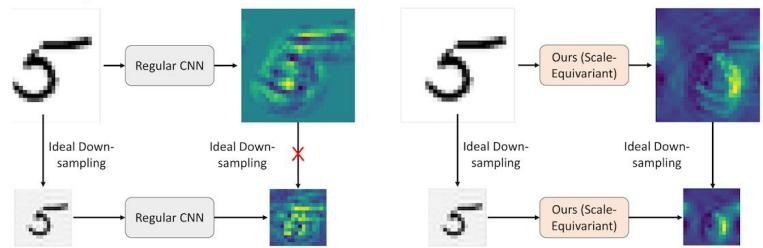
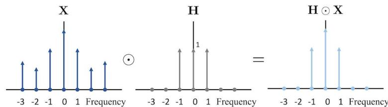
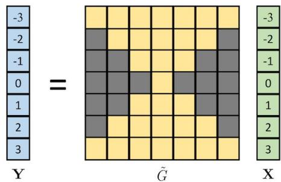
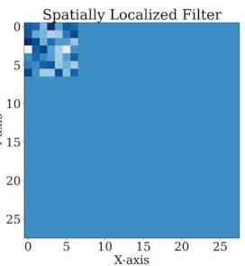
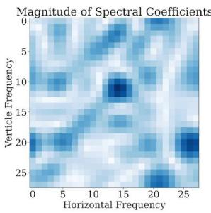
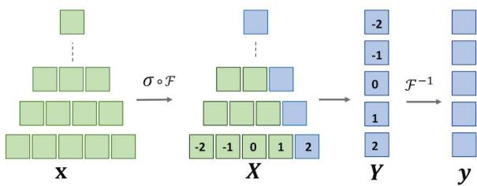
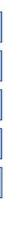
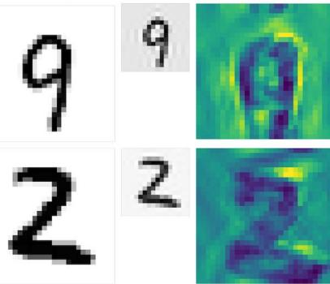
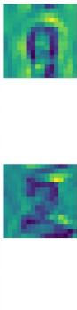
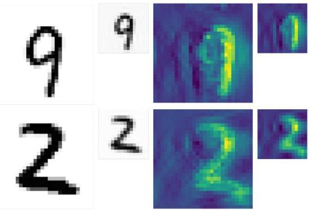

# MOTIVATION

  
Scale Equivariance:

·Scale-equivariance is crucial for consistent performance   
·Prior works did not consider aliasing,resulting in equivariance error

Can we design a perfect scale equivariant layer?

·Maintain scale consistency while achieving good performance

# Contributions:

·Propose scale-equivariant Fourier Layer   
·End-to-end equivariance with non-linearity and pooling   
· Connect scale equivariance to classification task for improved scale consistency.

# INTRODUCTION

Scaling Operation: Down-scaling a signal x ∈ RNcan be performed by subsampling by a scaling factor, i.e.,

$$
\operatorname {S u b} _ {R} (\mathbf {x}) [ n ] = \mathbf {x} [ R n ].
$$

Ideal Down-sampling: To avoid aliasing from subsampling,a lowpass filter $h$ must be performed,i.e.,

$$
\mathcal {D} _ {R} (\mathbf {x}) = \operatorname {S u b} _ {R} (\mathbf {h} * \mathbf {x}).
$$

# OUR APPROACH

# Scale Equivariant Deep Nets

Let $g$ denote a deep net such that $\mathbf { y } = g ( \mathbf { x } )$ . If this deep net $g$ can be equivalently represented as a set of functions $\dot { \tilde { G } } _ { k } : \mathbb { C } ^ { 2 k + 1 }  \dot { \mathbb { C } }$ such that

$$
\mathbf {Y} [ k ] = \tilde {G} _ {k} (\mathbf {X} [ - k: k ]) \forall k
$$

then $g$ is scale-equivariant. In other words, the output’s frequency terms can only depend on the terms in X that are equal or lower in frequencies. We illustrate this structure with a linear function, $\tilde { G }$ , in the Figure. The values of the Grey cells are 0.

# Spatially Localized Spectral Conv:

· $\checkmark$ Spectral convolution is scale equivariant   
·X Global in nature-ill fit for vision tasks   
·We propose Localized Spectral Convolution $\checkmark$ Maintains equivariance $\checkmark$ Captures local features

# Non-Linearity and Pooling:

·For any function $\sigma$ , its scale equivariant version, $\sigma _ { e q } ( { \bf x } ) = { \bf y }$ ,can be defined as

$$
\mathbf {Y} [ k ] = \mathcal {F} \left(\sigma \circ \mathcal {F} ^ {- 1} \left(\mathbf {X} \left[ - | k |: | k | \right]\right)\right) [ k ]
$$

where $\mathbf { X } = { \mathcal { F } } ( \mathbf { x } )$ and $\mathbf { Y } = { \mathcal { F } } ( \mathbf { y } )$

# Classification and Scaling:

· Invariance is not desirable for scaling   
·Classification loss should not increase at a higher scale   
·We propose scale consistency loss

$$
\mathcal {L} _ {c o n} = \max  \left(\mathcal {L} (\hat {\boldsymbol {y}} [ k ], y) - \mathcal {L} (\hat {\boldsymbol {y}} [ k - 1 ], y), 0\right).
$$

Here, $\hat { y } [ k ]$ is the prediction of classifier $\mathcal { M }$ at $k ^ { \mathrm { t h } }$ scale.

# RESULTS

Qualitative Results:Perfect scale equivalence with non-linearity and pooling (Left).Robust to non-ideal down-sampling (Right).

  
Ideal Downsampling

Quantitative Results:   
Results on MNIST-scale   
Non-Ideal Downsampling   
Results on MNIST-scale with missing Scales   

<table><tr><td>Models</td><td>Acc.↑</td><td>Scale-Con.↑</td><td>Equi-Err.↓</td></tr><tr><td>CNN</td><td>0.9737</td><td>0.6621</td><td>-</td></tr><tr><td>Per Res. CNN</td><td>0.9388</td><td>0.0527</td><td>-</td></tr><tr><td>SESN</td><td>0.9791</td><td>0.6640</td><td>-</td></tr><tr><td>DSS</td><td>0.9731</td><td>0.6503</td><td>-</td></tr><tr><td>SI-CovNet</td><td>0.9797</td><td>0.6425</td><td>-</td></tr><tr><td>SS-CNN</td><td>0.9613</td><td>0.3105</td><td>-</td></tr><tr><td>DISCO</td><td>0.9856</td><td>0.5585</td><td>0.44</td></tr><tr><td>Fourier CNN</td><td>0.9713</td><td>0.2421</td><td>0.28</td></tr><tr><td>Ours</td><td>0.9889</td><td>0.9716</td><td>0.00</td></tr></table>

Results on STL10-scale   

<table><tr><td>Models</td><td>Acc.↑</td><td>Scale-Con.↑</td><td>Equi-Err.↓</td></tr><tr><td>CNN</td><td>0.9737</td><td>0.6621</td><td>-</td></tr><tr><td>Per Res. CNN</td><td>0.9388</td><td>0.0527</td><td>-</td></tr><tr><td>SESN</td><td>0.9791</td><td>0.6640</td><td>-</td></tr><tr><td>DSS</td><td>0.9731</td><td>0.6503</td><td>-</td></tr><tr><td>SI-CovNet</td><td>0.9797</td><td>0.6425</td><td>-</td></tr><tr><td>SS-CNN</td><td>0.9613</td><td>0.3105</td><td>-</td></tr><tr><td>DISCO</td><td>0.9856</td><td>0.5585</td><td>0.44</td></tr><tr><td>Fourier CNN</td><td>0.9713</td><td>0.2421</td><td>0.28</td></tr><tr><td>Ours</td><td>0.9889</td><td>0.9716</td><td>0.00</td></tr></table>

Data Efficiency   

<table><tr><td>Models / # Samples</td><td>5000</td><td>2500</td><td>1000</td></tr><tr><td>CNN</td><td>0.9432</td><td>0.9389</td><td>0.8577</td></tr><tr><td>Per Res. CNN</td><td>0.9118</td><td>0.8392</td><td>0.5815</td></tr><tr><td>DISCO</td><td>0.9794</td><td>0.9665</td><td>0.9457</td></tr><tr><td>SESN</td><td>0.9638</td><td>0.9402</td><td>0.9207</td></tr><tr><td>SI-CovNet</td><td>0.9641</td><td>0.9437</td><td>0.9280</td></tr><tr><td>SS-CNN</td><td>0.9477</td><td>0.9259</td><td>0.9176</td></tr><tr><td>DSS</td><td>0.9654</td><td>0.9401</td><td>0.9281</td></tr><tr><td>Fourier CNN</td><td>0.9567</td><td>0.9419</td><td>0.8910</td></tr><tr><td>Ours</td><td>0.9835</td><td>0.9767</td><td>0.9606</td></tr></table>

<table><tr><td>Models</td><td>Acc.↑</td><td>Scale-Con.↑</td><td>Equi-Err.↓</td></tr><tr><td>Wide ResNet</td><td>0.5596</td><td>0.2916</td><td>0.16</td></tr><tr><td>SESN</td><td>0.5525</td><td>0.4166</td><td>0.04</td></tr><tr><td>DSS</td><td>0.5347</td><td>0.1979</td><td>0.02</td></tr><tr><td>SI-CovNet</td><td>0.5588</td><td>0.2187</td><td>0.03</td></tr><tr><td>SS-CNN</td><td>0.4788</td><td>0.1979</td><td>1.82</td></tr><tr><td>DISCO</td><td>0.4768</td><td>0.3541</td><td>0.06</td></tr><tr><td>Fourier CNN</td><td>0.5844</td><td>0.2812</td><td>0.19</td></tr><tr><td>Ours</td><td>0.7332</td><td>0.6770</td><td>0.00</td></tr></table>