# UniMax: Fairer and More Effective Language Sampling for Large-Scale Multilingual Pretraining

Hyung Won Chung,Xavier Garcia,Adam Roberts,YiTay,Orhan Firat,Sharan Narang, Noah Constant

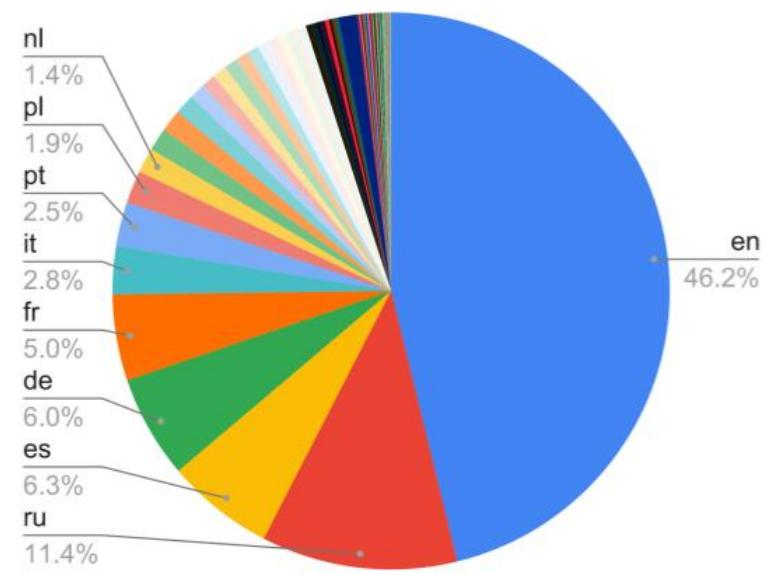

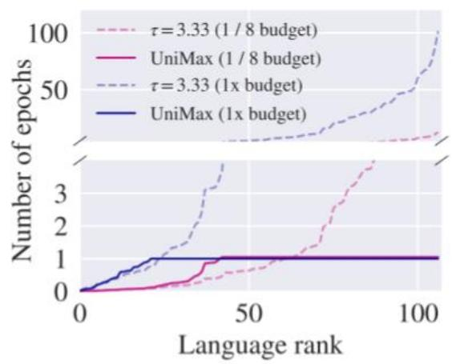  
(a)Number of training epochs for each language. Temperature samplingresultsina largenumber of data repeats for low-resource languages,whereas UNIMAX explicitly capsrepeats.

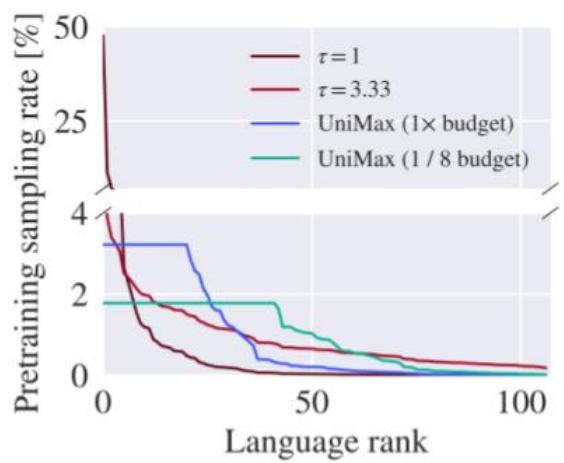  
(b)Pretraining sampling distribution.Temperature sampling results in poorly balanced distributions, whereas UNIMAX provides moreuniform distributions without excessive upsampling.

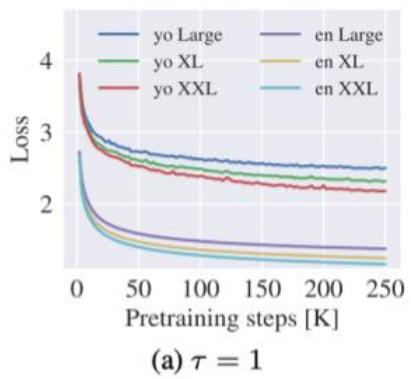

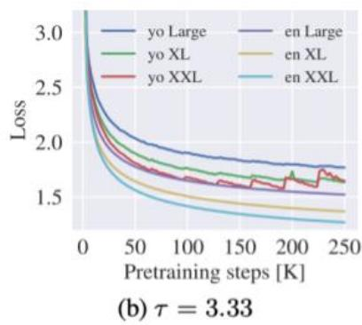

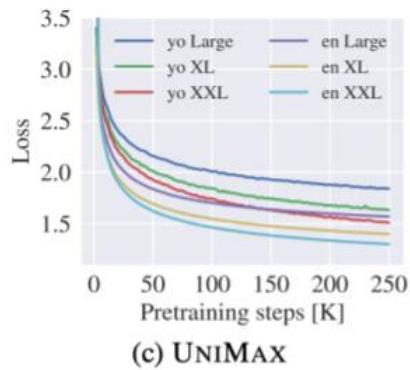  
Figure2:Pretraining cross-entropy loss on the held-out data over the training steps.With too-low temperature,low-resourcelanguages aresampled too litte,and theirlossesarerelatively high.With higher temperature,overfitting becomes more severe with increasing model size.

$$
p _ {l} = \frac {n _ {l}}{\sum_ {l ^ {\prime} \in L} n _ {l ^ {\prime}}} q _ {l} = \frac {p _ {l} ^ {1 / \tau}}{\sum_ {l ^ {\prime} \in L} p _ {l ^ {\prime}} ^ {1 / \tau}}
$$

<table><tr><td></td><td>Temperature (τ)</td></tr><tr><td>mBERT (Devlin et al., 2019)</td><td>1.43</td></tr><tr><td>XLM (Conneau &amp; Lample, 2019)</td><td>2.00</td></tr><tr><td>XLM-R (Conneau et al., 2020)</td><td>3.33</td></tr><tr><td>mT5 (Xue et al., 2021)</td><td>3.33</td></tr><tr><td>XLM-E (Chi et al., 2022)</td><td>1.43</td></tr></table>

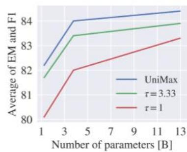  
(a)All languages

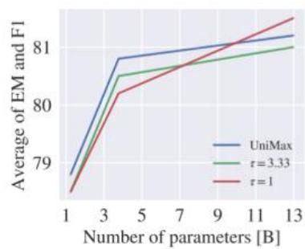  
(b)Higher-resource

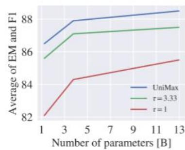  
(c)Lower-resource   
Figure4:Average TyDiQA GoldP performanceacross three model sizes.Overall,UNIMAXoutperforms both baselines at allmodel sizes considered.Breakdowns on higher-resource (top-5)and lower-resource (bottom-4) languages show UNIMAX outperforms $\tau = 3 . 3 3$ onbothhigh-and lowresource,and onlyunderperforms $\tau = 1$ onhigh-resource at large model scales.

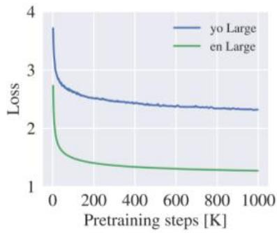  
（a）T=1

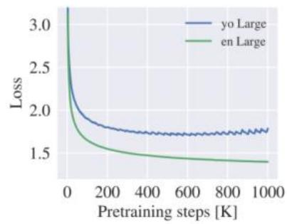  
（b)T=3.33

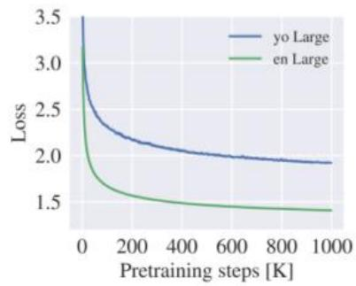  
（c)UNIMAX  
Figure3:Pretraining cross-entropy loss on the held-out data over1M trainingsteps.With the sequencelengthof512,thiscorresponds to1/2character budget.The overfittingbehavioremerges only after suficient number of training steps for $\tau = 3 . 3 3$

# Algorithm 1: UNIMAX

Inputs: Character count $c_{l}$ of each language $l$ in all the languages $L$ of the training corpus Total character budget $C$ The number of epochs per language $N$ Output: Sampling distribution $\mathcal{P}_l$ of each language   
// Sort the languages by increasing number of character counts $L\gets$ sortByCount(L) $B\gets C / /$ Initialize the remaining budget to the total character budget $i\gets 0$ for $l$ in $L$ do $b_{l}\leftarrow \frac{B}{\mathrm{len}(L) - i} / /$ Compute the remaining budget per-language if $b_{l} > c_{l}\times N$ then If per-language budget exceeds $N$ epochs of $l$ use $N$ epochs $U_{l}\gets c_{l}\times N$ else $\begin{array}{rl}{|}&{U_l\gets b_l/}\end{array}$ Otherwise use uniform per-language budget end if $B\gets B - U_l / /$ Update the remaining budget $i\gets i + 1$ end for $p\gets$ normalize(U)   
return $p$

Table 3:Comparison to mT5.XNLI and PAWS-X show average per-language accuracy; the rest showaverage per-languageEM/F1.Weuse the translate-train setting except for TyDiQA,which uses“in-language".Weomit results for theLarge configuration due to instabilities in training.   

<table><tr><td rowspan="2">Model</td><td colspan="2">XNLI</td><td colspan="2">PAWS-X</td><td colspan="2">XQuAD</td><td colspan="2">MLQA</td><td colspan="2">TyDi QA</td></tr><tr><td>mT5</td><td>umT5</td><td>mT5</td><td>umT5</td><td>mT5</td><td>umT5</td><td>mT5</td><td>umT5</td><td>mT5</td><td>umT5</td></tr><tr><td>Small</td><td>72.0</td><td>76.2</td><td>79.9</td><td>87.2</td><td>49.4 / 64.5</td><td>60.5 / 74.0</td><td>38.8 / 56.6</td><td>41.8 / 60.7</td><td>62.7 / 74.0</td><td>56.6 / 70.0</td></tr><tr><td>Base</td><td>79.8</td><td>80.8</td><td>89.3</td><td>90.4</td><td>59.7 / 75.3</td><td>67.3 / 79.8</td><td>48.5 / 67.6</td><td>51.6 / 70.5</td><td>68.4 / 79.7</td><td>68.4 / 81.0</td></tr><tr><td>XL</td><td>85.3</td><td>86.5</td><td>91.0</td><td>90.7</td><td>56.6 / 75.1</td><td>75.0 / 86.1</td><td>54.5 / 73.5</td><td>58.3 / 76.8</td><td>78.4 / 87.6</td><td>74.1 / 85.2</td></tr><tr><td>XXL</td><td>87.1</td><td>87.8</td><td>91.5</td><td>91.2</td><td>71.3 / 85.2</td><td>77.9 / 88.2</td><td>57.4 / 76.0</td><td>70.5 / 78.6</td><td>79.5 / 88.7</td><td>81.2 / 89.7</td></tr></table>

# Resources

·mC43.1.0,available via HuggingFace   
·umT5checkpoints,availablevia T5X repo