# Background: BERT and Randomized Masking

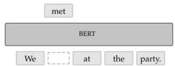

In NLP,having the model predict masked input words has beena powerful idea for learning general-purpose representations of language.

Can the same idea be useful in sequential decisionproblems?

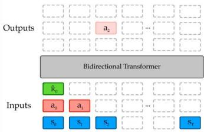

Tokens are states,actions,and rewards. Training for predicting masked inputs amounts to training on different inference tasks (e.g.BC,future prediction, etc.).

Ourquestion:by training on random mask prediction tasks,can we train a single multitask model for any task in a sequential decision problem?

# Inference Tasks as Masking Schemes

Key idea: any inference in sequential decision problems can be expresed as a sequence masking.

The model receives a subset of observed tokens (state,action,reward),and has to predict some other subset.

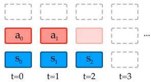  
Behavioral Cloning

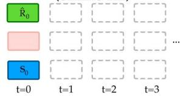  
Reward-conditioned (offline-RL)

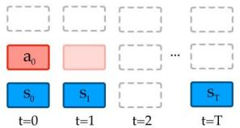  
Goal-conditioned

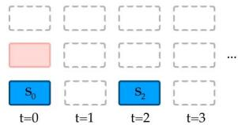  
Waypoint-conditioned

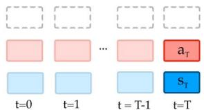  
Past inference

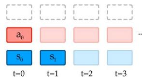  
Future inference

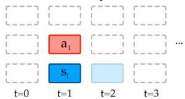  
Forward Dynamics

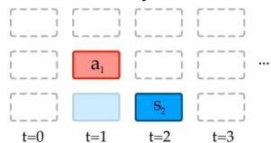  
Inverse Dynamics

# Many possible training regimes...

Trainspecialized multi-task,or

any-task models with a singl unifiedarchitecture

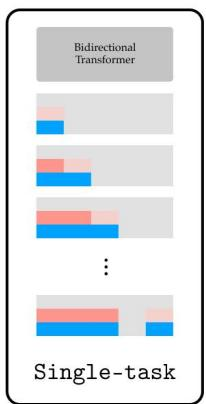

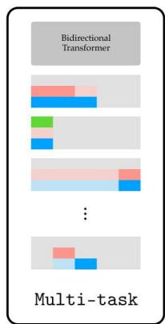

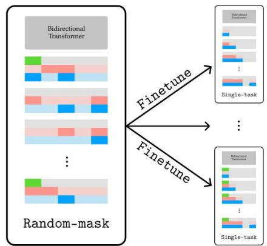

1. Can one train on all possible inference tasks and learn to do anything sensible?

Traininga single model onall tasks(viarandom masking） not only works,but can do as well or betterthan specializedmodels!

2. Which training regime is best if you care about a single downstream inference task?

While pre-training on multiple maskings does well, fine-tuning this general model one can improve performance further.

3. Which training regime is best if you care about $\pmb { n }$ downstream inference tasks?

Training onall possible tasks (with random masking) can sometimesenable to do better than trainingon then tasksofinterest.

# Results: a single set of model parameters for all tasks

# Discrete Minigrid Environment

Behavioral Cloning Conditioned on s0= (1)

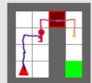

Goal-conditioned Conditioned on goal=(4,2)

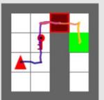

Reward-conditioned Conditioned on R=3 (actualR=3)

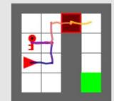

Waypoint-conditioned ConditionedonS=(1,1) waypoints: 2)

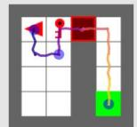

Backwards inference Conditioned on s10=（4,4)

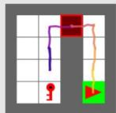

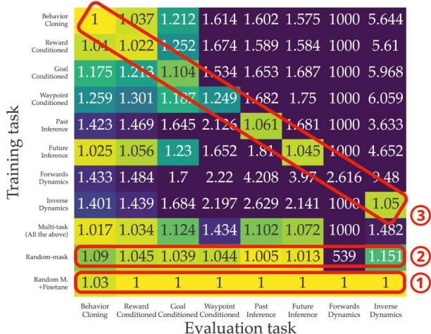  
Normalized validation loss (column-wise)

①random masking pretraining netuning

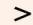

③Specialized models

②   
③Specialized models

# Continuous Control (Mujoco Maze2D)

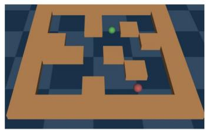

<table><tr><td rowspan="2">Model</td><td colspan="2">Context Length 5</td><td colspan="2">Context Length 10</td></tr><tr><td>BC</td><td>RC</td><td>BC</td><td>RC</td></tr><tr><td colspan="5">Uni[MASK] Models</td></tr><tr><td>Uni[MASK]-single-task</td><td>2.66 ± 0.03</td><td>2.64 ± 0.02</td><td>2.47 ± 0.04</td><td>2.41 ± 0.05</td></tr><tr><td>Uni[MASK]-multi-task (BC &amp; RC)</td><td>2.65 ± 0.01†</td><td>2.68 ± 0.01†</td><td>2.39 ± 0.03†</td><td>2.39 ± 0.03†</td></tr><tr><td>Uni[MASK]-multi-task + finetune</td><td>2.73 ± 0.01</td><td>2.74 ± 0.01</td><td>2.42 ± 0.04</td><td>2.42 ± 0.03</td></tr><tr><td>Uni[MASK]-random-mask</td><td>2.19 ± 0.09†</td><td>2.20 ± 0.09†</td><td>2.29 ± 0.07†</td><td>2.31 ± 0.06†</td></tr><tr><td>Uni[MASK]-finetune</td><td>2.67 ± 0.03</td><td>2.73 ± 0.01</td><td>2.55 ± 0.03</td><td>2.61 ± 0.03</td></tr><tr><td colspan="5">Other architectures</td></tr><tr><td>Feedforward Neural Network</td><td>1.68 ± 0.07</td><td>1.53 ± 0.08</td><td>1.83 ± 0.06</td><td>1.88 ± 0.06</td></tr><tr><td>Decision Transformer [7]</td><td>1.13 ± 0.07</td><td>1.49 ± 0.04</td><td>1.58 ± 0.06</td><td>1.70 ± 0.07</td></tr><tr><td>Our Decision-GPT model</td><td>2.66 ± 0.01</td><td>2.32 ± 0.05</td><td>2.74 ± 0.01</td><td>2.73 ± 0.02</td></tr></table>

# Pre-training and fine-tuning on single-tasks achieves the best perfomance among Uni[MASK] regimes.

Ourunidirectional single-task variant achieves best performance overall.

A single Uni[MASK] model can be used for arbitrary inference tasks out-ofthe-box when trained on random masking.

# Limitations and Future Work

· Scale up to more complex environments   
· Systematically investigate how multi-task performance varies with larger context windows   
· Train models to roll out trajectories conditioned on other useful properties (e.g., style-matching).

# Conclusions:

The Uni [MAsk] framework enables models to:

1. Naturally represent any inference task

2. Easily perform multi-task training with no architecture changes

3. Train single models to do all tasks with random-mask pre-training, which perform similarly to specialized models and often surpass them after fine-tuning.