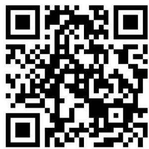
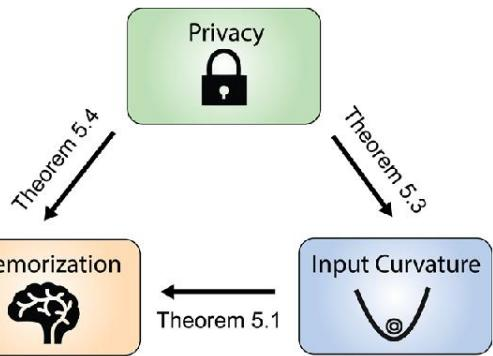
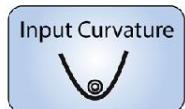
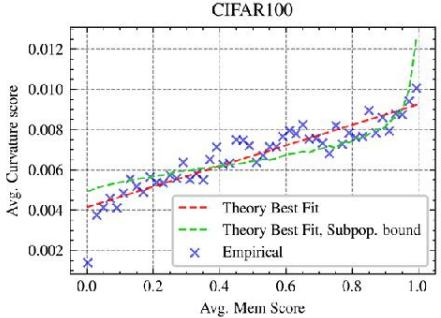
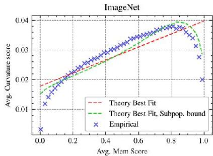
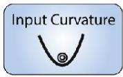
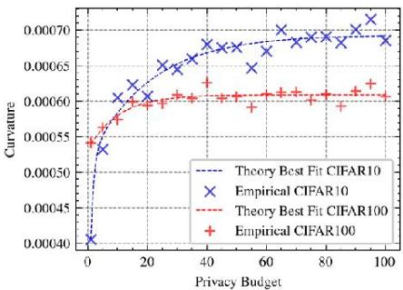
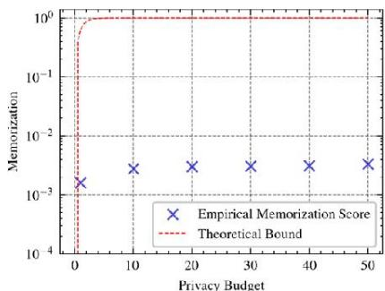
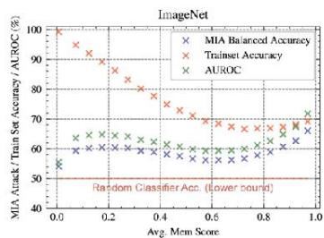
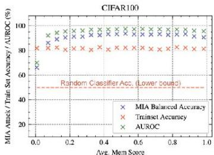

# Trustworthy Machine Learning ICML 2024

# Unveiling Privacy, Memorization,and Input Curvature Links

Deepak Ravikumar, Efstathia Soufleri,Abolfazl Hashemi,Kaushik Roy

PURDUE

UNIVERSITY

ICML

InternationalConference

On Machine Learning

CoCoSys

# OVERVIEW

Deep Neural Nets (DNNs)oftenoverfitand memorize training data,impactinggeneralization,noisy learning,and priacy. Feldman(2o19)proposedaformalmemorizationscore,butitiscomputationallyintensive.Recentworklinksinputloss curvaturewithmemorization,showingittobemuchmoreefficient.Wetheoreticallonnectmemorizationdierential privacy,and input loss curvature, validating our findings on CIFAR and ImageNet datasets.

# Motivation and Background

# Low Input Curvature Typical Easy

Images from ImageNet ranked using input loss curvature. Input loss curvature was obtained using a single ResNet18 trained on ImageNet. Ten lowest curvature samples (top) and ten highest curvature samples (bottom) from the training set are visualized for5classes (each row isa class) from ImageNet.Low curvature samplesare‘prototypical'of theirclass,while high curvature samples are rare,difficult,and more likely memorized instances

# High Input Curvature Atypical Hard

# Theory

Our theoretical framework provides upper bounds in Theorems 5.1,

5.3,and 5.4.These are visualizedas links between Differential

Privacy,Memorization,and Input Loss Curvature.

# Theoretical Results

Input Curvature is given by

$$
\operatorname {C u r v} _ {\phi} \left(z _ {i}, S\right) = \operatorname {t r} (H) = \operatorname {t r} \left(\nabla_ {z _ {i}} ^ {2} l \left(h _ {s} ^ {\phi}, z _ {i}\right)\right)
$$

Theorem5.1Input Curvature Upper Bounds Memorization

Lemma 5.2 Privacy $\Rightarrow$ Stability

Theorem5.3Privacy $\Rightarrow$ Low Input Loss Curvature

Theorem5.4Privacy $\Rightarrow$ Less Memorization

# Empirical Results

Memorization vs.Input Curvature

  
Theorem5.1

Herewe aim tounderstand howmemorization changes withcurvature.Theexperimentaims to plot the memorization scorevs.curvature score to validateour theoretical results.Wecalculatecurvature scores by averagingovermany seedsat theend of training.This measurement is proportional to the expected curvature score in Theorem 5.1

Plotof memorization score vs.input los curvatureat the end of trainingfor CIFAR100(averag over1000Small Inception models)

memorizationscore vs.input loss curvature at the end of training for ImageNet(average over100ResNet50 models)

  
Plotof

Differential Privacy vs.Input Curvature

  
Theorem5.3

Westudy the relation betweenprivacy and curvature,we train private ResNet18 models on CIFAR10 and CIFAR10O using DP-SGD (Abadi et al.,2016).We aim to plot privacy budget vs curvature score and validate Theorem 5.3

Result of studying the link between input loss curvature and privacy budget.All these results stronglycorrelate with theoryand validate Theorem 5.3.

Differential Privacyvs.Memorization

  
Theorem5.4

We how privacy affects memorization for the top 5oo most memorized examples.This is done by varying the privacy budget. The results align with Theorem 5.4,showingan increase in memorization as the privacy budget increases.

Plot of differential privacy vs memorization for CIFAR100 and the upperbound from the Theorem 5.4

The memorization scores are significantly lower than the bound fromTheorem 5.4 supportingNasretal.(2021)'sobservation that DP-SGD may be overly conservative.

Semiconductor Research Corporation

U.S. National

Science

Foundation

# Summary

·We explore the theoretical link between memorization, curvature,and privacy.   
·Theoretical analysis is based on assumptions of stability,generalization,and Lipschitzness,applicable to non-convex settings like DNNs.   
·Main result:Memorization is upper-bounded by the curvature of the loss with respect to input and privacy.   
·Privacy bounds input curvature and memorization   
·Theory validated using DNNson CIFAR100 and ImageNet,showinga strongmatch between theoretical predictions and empirical results.

# MIA Perspective

Acommonapproach to measure privacy is viamembership inferenceattack (MlA),WeusedtheLiRA (Carlini etal.,2022). More memorized samples are easier to detect using MlA attacks. ForlmageNet MlA performance dependsontheaccuracy of the samples in the trainset.If theaccuracy on the trainset is high and memorization is low,MlA is unsuccessful (mem.score $< 0 . 1 $ .If the memorizationishighbut themodel is inaccurate (scorerange0.4 -0.7)then due to lack of model learning MIA is unsuccessful but toa lesser extent. However,if memorization is high and accuracy onthesamples is high MlA is successful (mem. score $> 0 . 7$ ).

# References

Abadi,M.,Chu,A.,Goodfellow,I.,McMahan,H.B.,Mironov,1.,Talwar,K.,andZhang,L.Deeplearning withdifferentialprivacy.In Proceedingsof the2016ACMSIGSACconference oncomputerand communicationssecurity,pp.308-318,2016

Feldman,V.Does learning require memorization?ashort taleabouta longtail.arXivpreprint arXiv:1906.05271,2019

Nasr,M.,Songi,S.,Thakurta,A.,Papernot,N.andCarlini,N.Adversary instantiation:Lowerboundsfor diferentiallyprivatemachine learning.In2021IEEESymposiumonsecurityandprivacy(SP),pp.866 882.IEEE,2021.