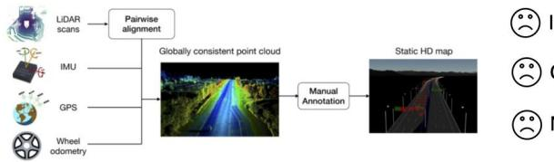
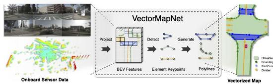
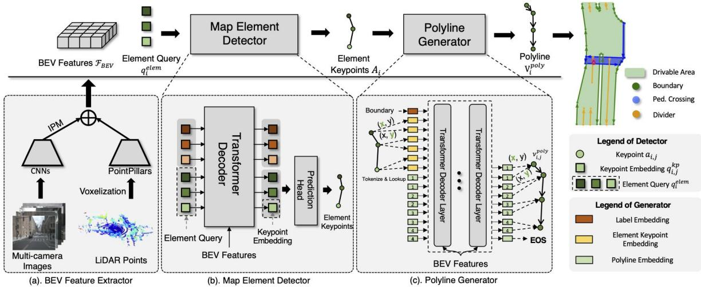
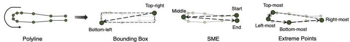
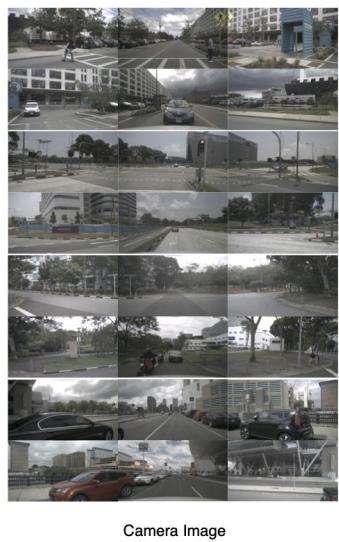
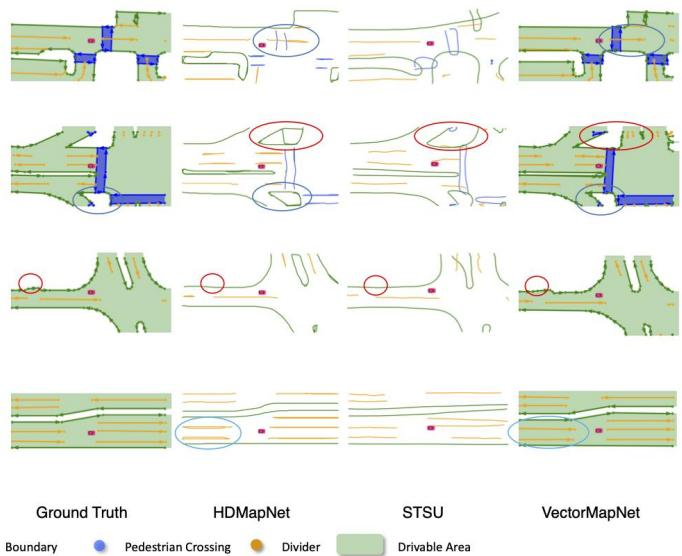
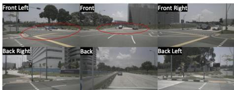
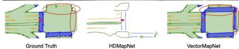
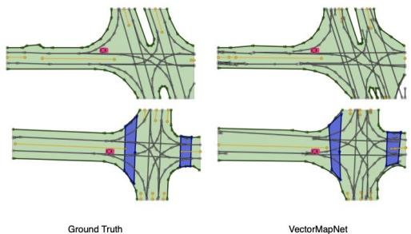

# Motivations

Autonomous driving systems require an understanding of map elements on the road,including lanes,pedestriancrossing,and traffic signs,to navigatearound the world.

nvolvesa complex pipeline

Costlyand laborintensive

Needstimelyupdate

In contrast, we focus on using onboard sensors, including LiDARs and cameras,to estimate map elements on-the-fly.

Simpleand end-to-end pipeline

Cheap and automatic

Perceives dynamic environment

# Contributions

·VectorMapNet is an end-to-end mapping approach.   
·We utilize polyline to accommodate the heterogeneous nature of map elements.   
·Our method achieves promising performance in online semantic HD map learning tasks.

# Problem Formulation

Similar to HDMapNet,our task is to generate vectorized map elements using data from onboard sensors of autonomous vehicle,such as RGB cameras and/or LiDARs.These map elements include:

·Lane dividers:boundaries dividing lanes on the road,usually straight lines.   
Road boundaries:boundaries of roads separating roadsand sidewalks,typicallyiregularly-shaped curves of arbitrary lengths.   
·Pedestrian crossings: regions with white markings indicating legal pedestrian crossing points, typically representedaspolygons.   
·Centerlines:line segments that commonly used for driving direction,vehicle positioning,and navigation.

# Why use polyline to represent maps?

Using polylines to represent map elements has three main advantages:

·Polylines are a flexible primitive thatcan represent complex geometric elements in HD maps.   
·Theorder of polyline vertices isa natural way to encode thedirection of map elements.   
·The polyline representation has been widely used bydownstream tasks,such as motion forecasting.

# VectorMapNet

VectorMapNetendtndodel,iesignedtoepresentamapithparseetofpolylinesthusforulatingthetasareet detection problem.In our approach,we divide the task into three distinct components

(1)ABEVFeature Extractor(AvariantofIPM)thatliftsvarioussensormodalityinputs intoacanonicalfeaturespace(BEVspace).   
(2)AmapelementdetectorDER-likeTransformerdecoder)thatlocateandclasifiesallmaelementsbypredictingelementeypontsAi and their class labels $l _ { i }$   
(3)APolylineGenerator(VanilaTransformerdecoder)thatproducesasequenceoforderedpolylineverticeswhichdescribesthelocal geometry of each detected map element $A _ { i } , l _ { i }$

  
Three diferent keypoint representations are proposed here.

# VectorMapNet for Motion Forecasting

Toevaluate thecapacity of ourmethod and to investigate itsusefulness in downstream tasks,we put our predicted HD map to the test within a motion forecasting task.

Motion Forecasting heavilyrelies on precise map information for accurate prediction of future motion.

<table><tr><td>Model Inputs</td><td>minADE ↓</td><td>minFDE↓</td><td>MR@2m↓</td></tr><tr><td>Traj.</td><td>0.909</td><td>1.577</td><td>19.6</td></tr><tr><td>Traj. + G.T. Map</td><td>0.779</td><td>1.390</td><td>18.0</td></tr><tr><td>Traj. + Pred. Map</td><td>0.826</td><td>1.477</td><td>18.2</td></tr></table>

# Quantitative Results

We report the average precision that uses Chamfer distance and Fréchet Distance as the threshold.

□ Results on nuScenes

<table><tr><td>Methods</td><td>\( {\mathrm{{AP}}}_{ped} \)</td><td>\( {\mathrm{{AP}}}_{\text{divider }} \)</td><td>\( {\mathrm{{AP}}}_{\text{boundary }} \)</td><td>mAP</td></tr><tr><td>STSU (Can et al., 2021)</td><td>7.0</td><td>11.6</td><td>16.5</td><td>11.7</td></tr><tr><td>HMapNet (Camera) (Li et al., 2021)</td><td>14.4</td><td>21.7</td><td>33.0</td><td>23.0</td></tr><tr><td>HMapNet (LiDAR) (Li et al., 2021)</td><td>10.4</td><td>24.1</td><td>37.9</td><td>24.1</td></tr><tr><td>HMapNet (Fusion) (Li et al., 2021)</td><td>16.3</td><td>29.6</td><td>46.7</td><td>31.0</td></tr><tr><td>VectorMapNet (Camera)</td><td>36.1</td><td>47.3</td><td>39.3</td><td>40.9</td></tr><tr><td>VectorMapNet (Camera) + fine-tune</td><td>42.5</td><td>51.4</td><td>44.1</td><td>46.0</td></tr><tr><td>VectorMapNet (LiDAR)</td><td>25.7</td><td>37.6</td><td>38.6</td><td>34.0</td></tr><tr><td>VectorMapNet (Fusion)</td><td>37.6</td><td>50.5</td><td>47.5</td><td>45.2</td></tr><tr><td>VectorMapNet (Fusion) + fine-tune</td><td>48.2</td><td>60.1</td><td>53.0</td><td>53.7</td></tr></table>

□ Results on Argoverse2

# Qualitative Results

Using polylines as primitives has brought us two benefits compared with baselines:

·Polylines efectively encode the detailed mapgeometries,e.g.,the corners of boundaries (red elipses).   
：Polyline representations prevent Model from generatingambiguous results,as it consistently encodes direction information.Incontrast, Rasterized methodsareprone to falsely generating loopycurves (blue ellipses ).

A benefit of of posing map learning asa detection problem:

The model can identify pedestrian crossingsat intersections that are missed in theannotations of the HD map provided by the dataset.

# Centerline Generation

To demonstrate the flexibility of polyline,we expand VectorMapNetto predict centerlines.

<table><tr><td rowspan="2">Keypoint Representation</td><td rowspan="2">#dim</td><td colspan="4">Fréchet Distance</td><td colspan="4">Chamfer Distance</td></tr><tr><td>APped</td><td>APdivider</td><td>APboundary</td><td>mAP</td><td>APped</td><td>APdivider</td><td>APboundary</td><td>mAP</td></tr><tr><td>HMapNet (Camera) (Li et al., 2021)</td><td>2</td><td>-</td><td>-</td><td>-</td><td>-</td><td>13.1</td><td>5.7</td><td>37.6</td><td>18.8</td></tr><tr><td>VectorMapNet (Camera)</td><td>2</td><td>43.2</td><td>45.5</td><td>52.0</td><td>46.9</td><td>38.3</td><td>36.1</td><td>39.2</td><td>37.9</td></tr><tr><td>VectorMapNet (Camera)</td><td>3</td><td>41.7</td><td>42.3</td><td>49.9</td><td>44.6</td><td>36.5</td><td>35.0</td><td>36.2</td><td>35.8</td></tr></table>

# Reference

HDMapNet:An Online HD Map Constructionand Evaluation Framework,Li etal.,ICRA2022 Structured bird's-eye-viewtraffic sceneunderstanding from onboard images,Can etal.,ICCV2021