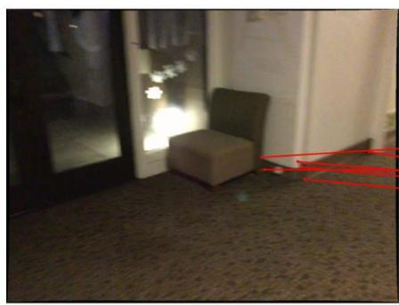
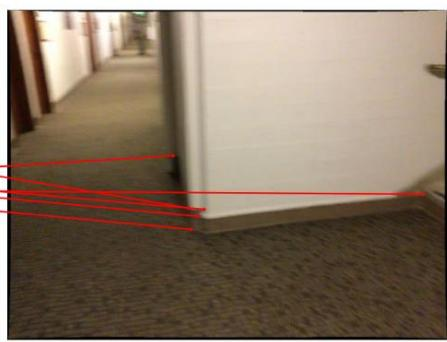
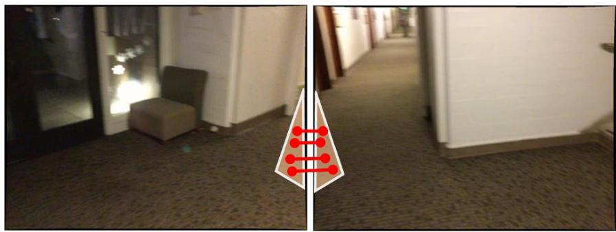
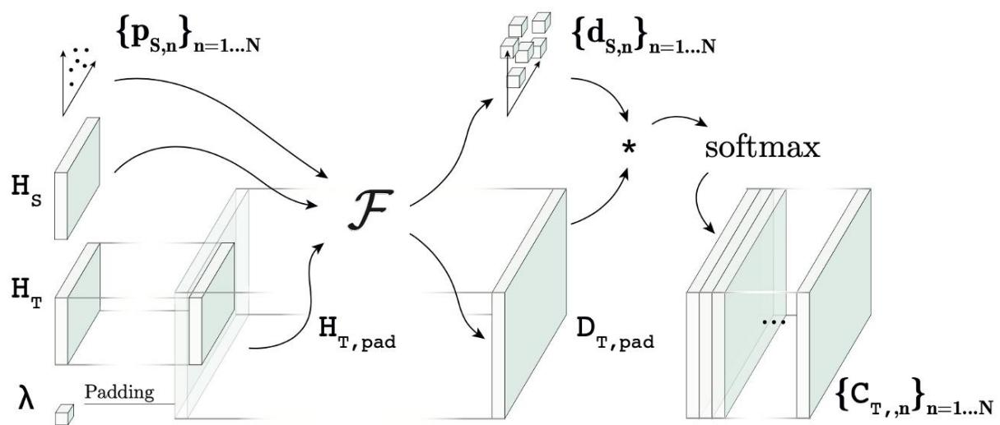
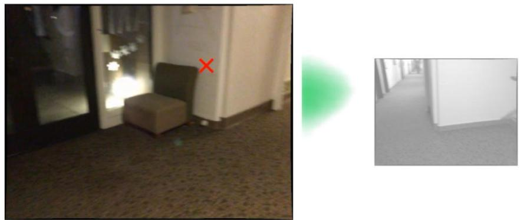
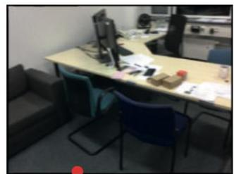
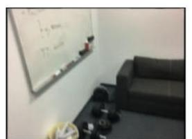
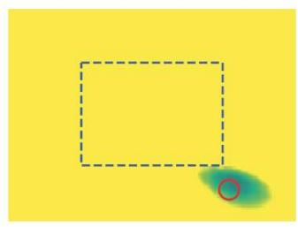

hugogermain.com/neurhal

# Visual Correspondence Hallucination

Hugo Germain1

Vincent Lepetit1

Guillaume Bourmaud2

# 1. Low-overlap keypoint matching

Keypoint matching is key for fundamental matrix& camera pose estimation   
In low-overlap scenarios however, finding correspondences is very challenging   
Existing methods will tend to find correspondences in non-covisible areas

  
SuperPoint $^ +$ SuperGlue

Correct matches within image boundaries provide poor constraints

# 2. Introducing NeurHal

We predict correspondence maps on extended field-of-views

Training is done on both covisible and non-covisible samples

We resort to a Transformer-based image processing backbone

# 3. Application to absolute camera pose estimation

  
We provide quantitative analysis of NeurHal's ability to hallucinate

  
NeurHal on validation image pair (novel scene)

  
NeurHal achieves sota on absolute pose estimation for low-overlap image pairs

  
More results in our paper !

  
Source

  
Target

  
Predicted NRE Map