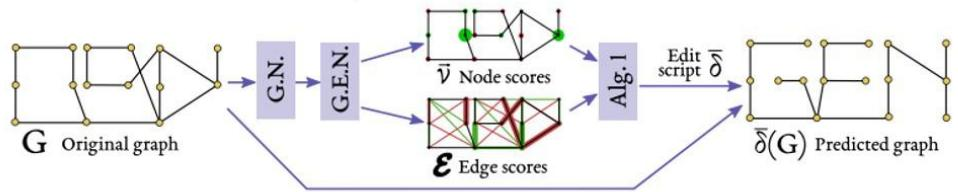
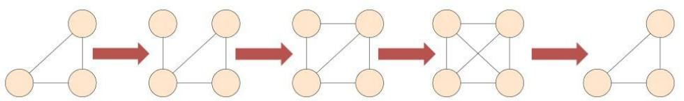
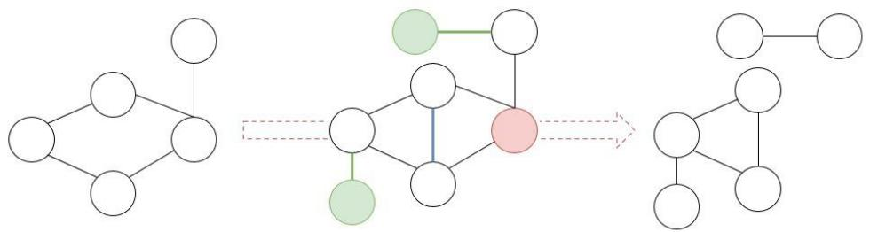
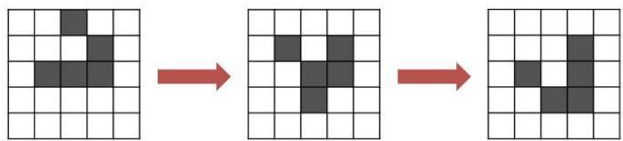
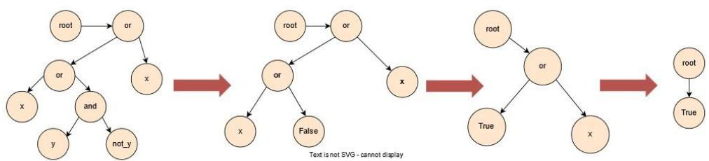
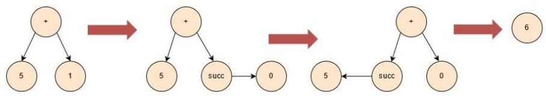
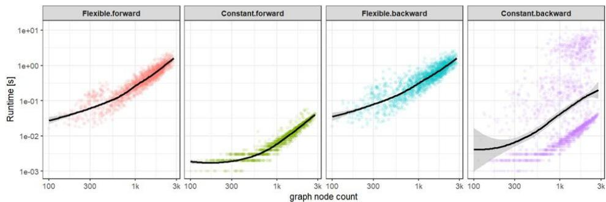
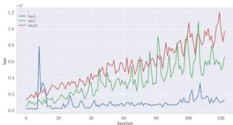
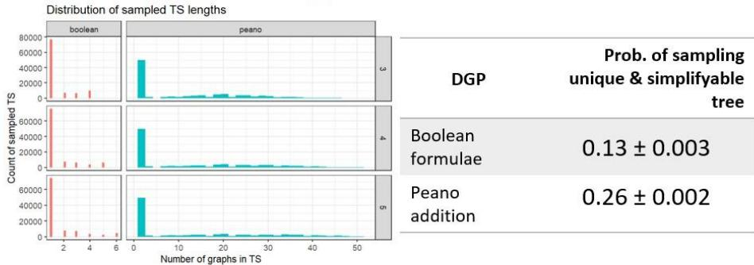

# Reproduced: Paaβen et. al. (ICLR, 2021)

Thereproduced paper [bpa21] proposesanovel output layer for graph neural networks (GNNs),the graph edit network called (GEN).This layer yieldsa sequence of graph edits:node insertions,node deletions,node replacements,edge insertionsand edgedeletions.These finite sequences of edits,alsoreferred toasedit scriptsare general enough todescribe any graph-to-graph transformationand are not only veryinterpretablefor humans,but also computationallyefficient.These properties establish GENsasauseful tool forwork in the domainof graph timeseries prediction under the Markovianassumption.

Theauthors empirically underpin their theoretical claims about GENs by showing that they perform wellina series of graph time-series prediction tests.They define several data generating processes (DGPs),from which the GEN attempts to learn the user-defined mapping functions.Ourwork reproduces these experiments and evaluates the suitability of the DGPs for the conclusions made in the original paper.

# DGPs & Tests

Thepaperevaluated several keyclaimsonsyntheticdatasets,generated withdata generatingrules,interpreted in the following figures.

  
Graphcycles:Atrivial set of userdefined graph transformations without any logical rules.

  
Degreerules:Asetofrules fornode&edgeinsertions.(nodeswithdegree≥3aredeleted;noeswithcommonneighbor

  
Conway'sGameofLife:Aseriesbasedonnodeedits(editingAlive/Deadbinaryfeature)onalaticegraph,adhering to Conway'sGameofLife[Gar70].

  
BooleanFormulae:RandomBoolean formulae,simplifiedwithruleslikexA-x→⊥,untiltreecannotbe simplified.

  
PeanoAddition:Seriesoftreegraphs,modelingadditionproblemsviaPeano'sdefinitionofaddition(m+succ(n)= succ（m）+nand $m + { \cal { O } } = m )$ using one-hot node features.

# [Re] Original experimental claims

[bpa21] makes three experimental conclusions based on a series of experiments.√symbols below denotea successful reproduction of results.

GENsoutperform baselines (Variational Graph Autoencoders[KW16]& Variational Graph Recurrent nets [HHN19]) on time-series prediction tasks, generated from Graph Cycles,Degree Rules&Game of Life DGPs.   
GENs achieve $100 \%$ accuracy on time-series prediction tasks on graphs, generatedfrom Boolean Formulae&Peano Addition DGPs.   
？Theruntime of forward passes of a GEN scales sub-quadratically as the number of nodes ina graph increases.The runtime of training back-passes scalesapproximatelylinearly.

  
Theruntime of graph scale dependence.Results forthe backwardpasses are not consistent with the claim.

<table><tr><td>Pass direction</td><td>Edge filtering</td><td>Log-log linear slope fit</td></tr><tr><td rowspan="2">Forward</td><td>Flexible</td><td>1.38 ± 0.02</td></tr><tr><td>Constant</td><td>1.31 ± 0.02</td></tr><tr><td rowspan="2">Backward</td><td>Flexible</td><td>1.30 ± 0.01</td></tr><tr><td>Constant</td><td>1.69 ± 0.10</td></tr></table>

Theruntime scaling evaluation was carried out on the ArXivcitationnetwork[LKF05]withthegraphvariants generatedbyadifferentnumber ofmonthsconsidered.

While the focus here is speed,we have to note that the experiment intheoriginalpaperfailstooptimize the criterion loss,thus castingdoubt on theresults.

# Improving the experimental setup

Thefacts that graph-to-graph transitionsare deterministic and that the space of unique graphs that may be generated by the DGPs is limited (as shown in the table below),arose some concern about the experimental setup:Does the solver generalize,or does it simply memorize the graphto-graph transitions?

<table><tr><td></td><td>Graph cycles</td><td>Degree rules</td><td>Game of life</td><td>Boolean formulae</td><td>Peano addition</td></tr><tr><td># unique graphs</td><td>9</td><td>12346</td><td>2100</td><td>10788</td><td>34353</td></tr></table>

We reproduced the claims (1)and (2) with the following adjustments:

Increased cardinality of test time series $( 5 \to 1 0 0 )$   
Ensured no duplicates between train& test set   
·Used established random graph generation methods (ie.Erdäs-Renyi)

Wenoticed that most sampled graphsin the tree dynamic graph experimentswereun-simplifyable,soconstraintswererelaxed here.

  
Results were generally worse,but still within a reasonable margin of error.

# Concluding reproduction notes

Our experimental results conclusively show that most of the claims in the original work hold.However，our work beyond the original paper emphasizes theneed to payattention to the experimental setup,especially whenworking with synthetically generated data，sampled from functions, rather than gathered froman external system.

# References

[bpa21] PaaBen,Benjamin,etal."Graphedit networks."In: International Conference   
[Gar70] Martin Gardner.“The fantastic combinations of John Conway's newsolitaire gameoflife.In:Sc.Am.,223:20-123,1970   
[KW16] ThomasN.Kipfand MaxWeling.“Variational graphauto-encoders"In: Proceedings of the NIPS2016Workshop onBayesian Deep Learning，2016

[HHN19] Hajiramezanali,Ehsan,et.al.“Variational graph recurrent neural networks.”

[LKF05]Leskovec,Jure,Jon Kleinberg,and Christos Faloutsos."Graphs over time: densification laws，shrinkingdiametersandpossibleexplanations."ln:Proceedingsof theeleventh ACM SIGKDD international conference on Knowledge discovery indata